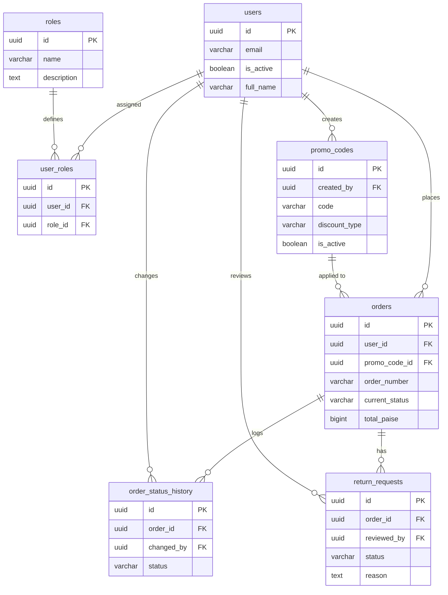

```mermaid
erDiagram
    users {
        uuid id PK
        varchar email
        boolean is_active
        varchar full_name
    }

    roles {
        uuid id PK
        varchar name
        text description
    }

    user_roles {
        uuid id PK
        uuid user_id FK
        uuid role_id FK
    }

    orders {
        uuid id PK
        uuid user_id FK
        uuid promo_code_id FK
        varchar order_number
        varchar current_status
        bigint total_paise
    }

    order_status_history {
        uuid id PK
        uuid order_id FK
        uuid changed_by FK
        varchar status
    }

    promo_codes {
        uuid id PK
        uuid created_by FK
        varchar code
        varchar discount_type
        boolean is_active
    }

    return_requests {
        uuid id PK
        uuid order_id FK
        uuid reviewed_by FK
        varchar status
        text reason
    }

    users ||--o{ user_roles : "assigned"
    roles ||--o{ user_roles : "defines"
    users ||--o{ orders : "places"
    orders ||--o{ order_status_history : "logs"
    users ||--o{ order_status_history : "changes"
    promo_codes ||--o{ orders : "applied to"
    users ||--o{ promo_codes : "creates"
    orders ||--o{ return_requests : "has"
    users ||--o{ return_requests : "reviews"
```
