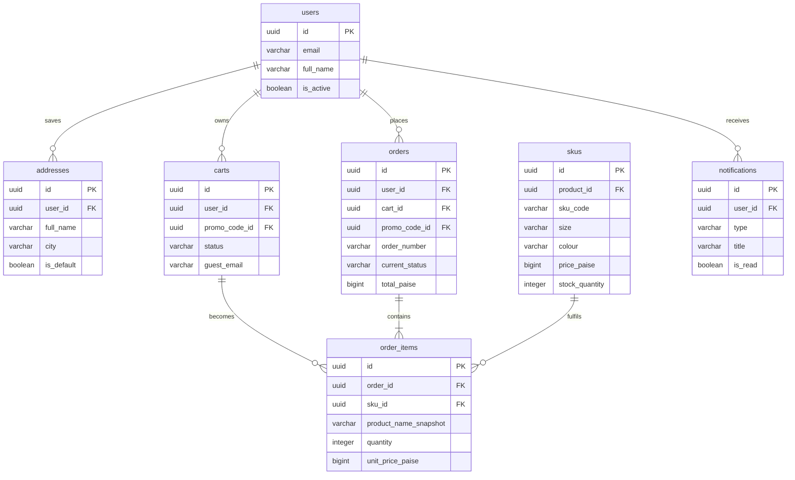

```mermaid
erDiagram
    users {
        uuid id PK
        varchar email
        varchar full_name
        boolean is_active
    }

    addresses {
        uuid id PK
        uuid user_id FK
        varchar full_name
        varchar city
        boolean is_default
    }

    carts {
        uuid id PK
        uuid user_id FK
        uuid promo_code_id FK
        varchar status
        varchar guest_email
    }

    orders {
        uuid id PK
        uuid user_id FK
        uuid cart_id FK
        uuid promo_code_id FK
        varchar order_number
        varchar current_status
        bigint total_paise
    }

    order_items {
        uuid id PK
        uuid order_id FK
        uuid sku_id FK
        varchar product_name_snapshot
        integer quantity
        bigint unit_price_paise
    }

    skus {
        uuid id PK
        uuid product_id FK
        varchar sku_code
        varchar size
        varchar colour
        bigint price_paise
        integer stock_quantity
    }

    notifications {
        uuid id PK
        uuid user_id FK
        varchar type
        varchar title
        boolean is_read
    }

    users ||--o{ addresses : "saves"
    users ||--o{ carts : "owns"
    users ||--o{ orders : "places"
    users ||--o{ notifications : "receives"
    carts ||--o{ order_items : "becomes"
    orders ||--|{ order_items : "contains"
    skus ||--o{ order_items : "fulfils"
```
