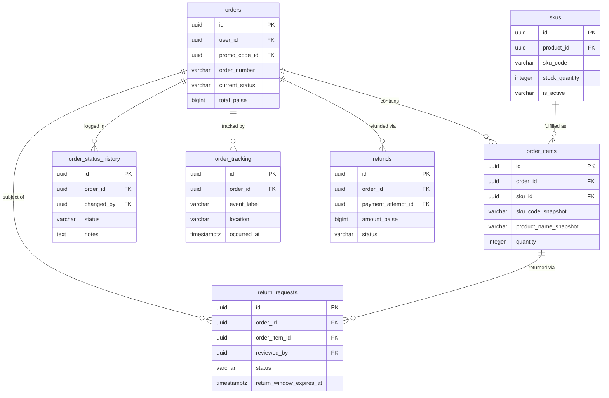

```mermaid
erDiagram
    orders {
        uuid id PK
        uuid user_id FK
        uuid promo_code_id FK
        varchar order_number
        varchar current_status
        bigint total_paise
    }

    order_items {
        uuid id PK
        uuid order_id FK
        uuid sku_id FK
        varchar sku_code_snapshot
        varchar product_name_snapshot
        integer quantity
    }

    order_status_history {
        uuid id PK
        uuid order_id FK
        uuid changed_by FK
        varchar status
        text notes
    }

    return_requests {
        uuid id PK
        uuid order_id FK
        uuid order_item_id FK
        uuid reviewed_by FK
        varchar status
        timestamptz return_window_expires_at
    }

    skus {
        uuid id PK
        uuid product_id FK
        varchar sku_code
        integer stock_quantity
        varchar is_active
    }

    order_tracking {
        uuid id PK
        uuid order_id FK
        varchar event_label
        varchar location
        timestamptz occurred_at
    }

    refunds {
        uuid id PK
        uuid order_id FK
        uuid payment_attempt_id FK
        bigint amount_paise
        varchar status
    }

    orders ||--o{ order_items : "contains"
    orders ||--o{ order_status_history : "logged in"
    orders ||--o{ return_requests : "subject of"
    orders ||--o{ order_tracking : "tracked by"
    orders ||--o{ refunds : "refunded via"
    order_items ||--o{ return_requests : "returned via"
    skus ||--o{ order_items : "fulfilled as"
```
