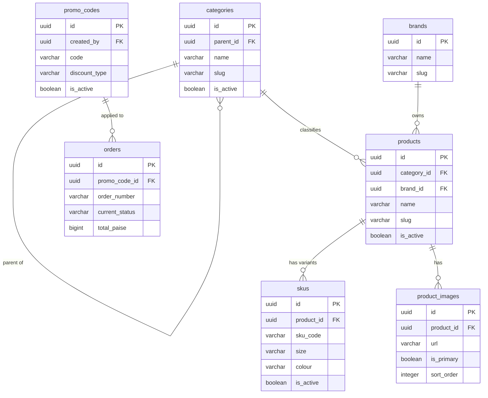

```mermaid
erDiagram
    products {
        uuid id PK
        uuid category_id FK
        uuid brand_id FK
        varchar name
        varchar slug
        boolean is_active
    }

    categories {
        uuid id PK
        uuid parent_id FK
        varchar name
        varchar slug
        boolean is_active
    }

    brands {
        uuid id PK
        varchar name
        varchar slug
    }

    skus {
        uuid id PK
        uuid product_id FK
        varchar sku_code
        varchar size
        varchar colour
        boolean is_active
    }

    product_images {
        uuid id PK
        uuid product_id FK
        varchar url
        boolean is_primary
        integer sort_order
    }

    promo_codes {
        uuid id PK
        uuid created_by FK
        varchar code
        varchar discount_type
        boolean is_active
    }

    orders {
        uuid id PK
        uuid promo_code_id FK
        varchar order_number
        varchar current_status
        bigint total_paise
    }

    categories ||--o{ categories : "parent of"
    categories ||--o{ products : "classifies"
    brands ||--o{ products : "owns"
    products ||--o{ skus : "has variants"
    products ||--o{ product_images : "has"
    promo_codes ||--o{ orders : "applied to"
```
