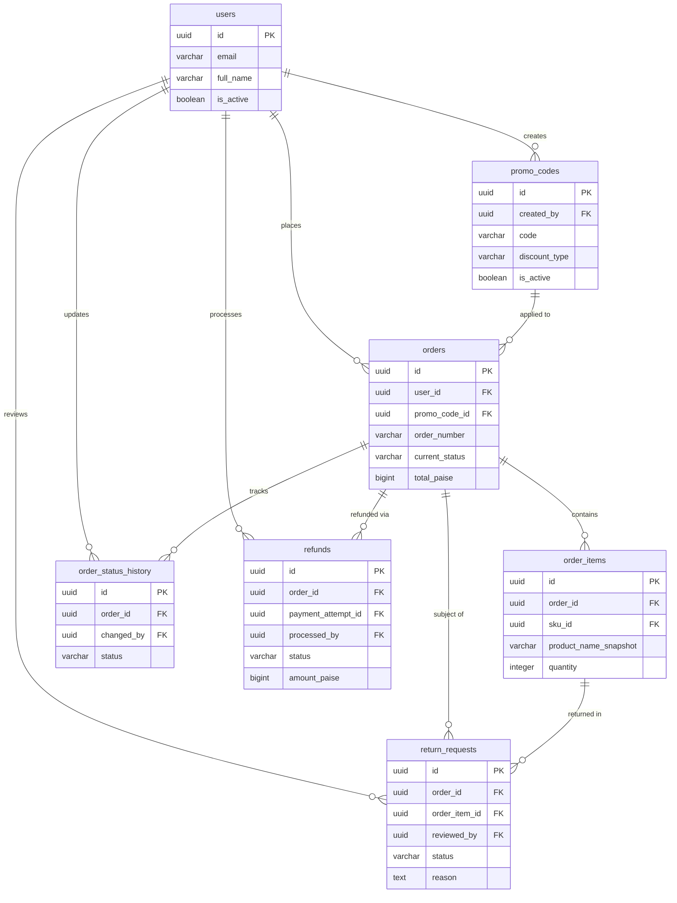

```mermaid
erDiagram
    users {
        uuid id PK
        varchar email
        varchar full_name
        boolean is_active
    }

    orders {
        uuid id PK
        uuid user_id FK
        uuid promo_code_id FK
        varchar order_number
        varchar current_status
        bigint total_paise
    }

    order_items {
        uuid id PK
        uuid order_id FK
        uuid sku_id FK
        varchar product_name_snapshot
        integer quantity
    }

    order_status_history {
        uuid id PK
        uuid order_id FK
        uuid changed_by FK
        varchar status
    }

    return_requests {
        uuid id PK
        uuid order_id FK
        uuid order_item_id FK
        uuid reviewed_by FK
        varchar status
        text reason
    }

    refunds {
        uuid id PK
        uuid order_id FK
        uuid payment_attempt_id FK
        uuid processed_by FK
        varchar status
        bigint amount_paise
    }

    promo_codes {
        uuid id PK
        uuid created_by FK
        varchar code
        varchar discount_type
        boolean is_active
    }

    users ||--o{ orders : "places"
    users ||--o{ order_status_history : "updates"
    users ||--o{ return_requests : "reviews"
    users ||--o{ refunds : "processes"
    users ||--o{ promo_codes : "creates"
    orders ||--o{ order_items : "contains"
    orders ||--o{ order_status_history : "tracks"
    orders ||--o{ return_requests : "subject of"
    orders ||--o{ refunds : "refunded via"
    order_items ||--o{ return_requests : "returned in"
    promo_codes ||--o{ orders : "applied to"
```
