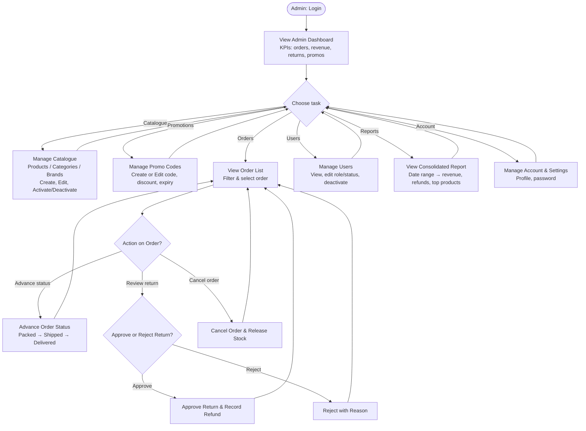

```mermaid
flowchart TD
    A([Admin: Login]) --> B[View Admin Dashboard\nKPIs: orders, revenue, returns, promos]
    B --> C{Choose task}

    C -->|Catalogue| D[Manage Catalogue\nProducts / Categories / Brands\nCreate, Edit, Activate/Deactivate]
    D --> C

    C -->|Promotions| E[Manage Promo Codes\nCreate or Edit code, discount, expiry]
    E --> C

    C -->|Orders| F[View Order List\nFilter & select order]
    F --> G{Action on Order?}
    G -->|Advance status| H[Advance Order Status\nPacked → Shipped → Delivered]
    G -->|Review return| I{Approve or Reject Return?}
    I -->|Approve| J[Approve Return & Record Refund]
    I -->|Reject| K[Reject with Reason]
    G -->|Cancel order| L[Cancel Order & Release Stock]
    H --> F
    J --> F
    K --> F
    L --> F

    C -->|Users| M[Manage Users\nView, edit role/status, deactivate]
    M --> C

    C -->|Reports| N[View Consolidated Report\nDate range → revenue, refunds, top products]
    N --> C

    C -->|Account| O[Manage Account & Settings\nProfile, password]
    O --> C
```
