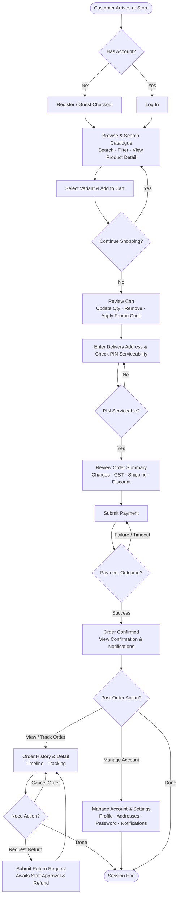

```mermaid
flowchart TD
    A([Customer Arrives at Store]) --> B{Has Account?}
    B -- No --> C[Register / Guest Checkout]
    B -- Yes --> D[Log In]
    C --> E
    D --> E

    E[Browse & Search Catalogue\nSearch · Filter · View Product Detail] --> F[Select Variant & Add to Cart]
    F --> F2{Continue Shopping?}
    F2 -- Yes --> E
    F2 -- No --> G[Review Cart\nUpdate Qty · Remove · Apply Promo Code]

    G --> H[Enter Delivery Address & Check PIN Serviceability]
    H --> I{PIN Serviceable?}
    I -- No --> H
    I -- Yes --> J[Review Order Summary\nCharges · GST · Shipping · Discount]

    J --> K[Submit Payment]
    K --> L{Payment Outcome?}
    L -- Failure / Timeout --> K
    L -- Success --> M[Order Confirmed\nView Confirmation & Notifications]

    M --> N{Post-Order Action?}
    N -- View / Track Order --> O[Order History & Detail\nTimeline · Tracking]
    O --> P{Need Action?}
    P -- Cancel Order --> O
    P -- Request Return --> Q[Submit Return Request\nAwaits Staff Approval & Refund]
    Q --> O
    P -- Done --> R([Session End])
    N -- Manage Account --> S[Manage Account & Settings\nProfile · Addresses · Password · Notifications]
    S --> R
    N -- Done --> R
```
