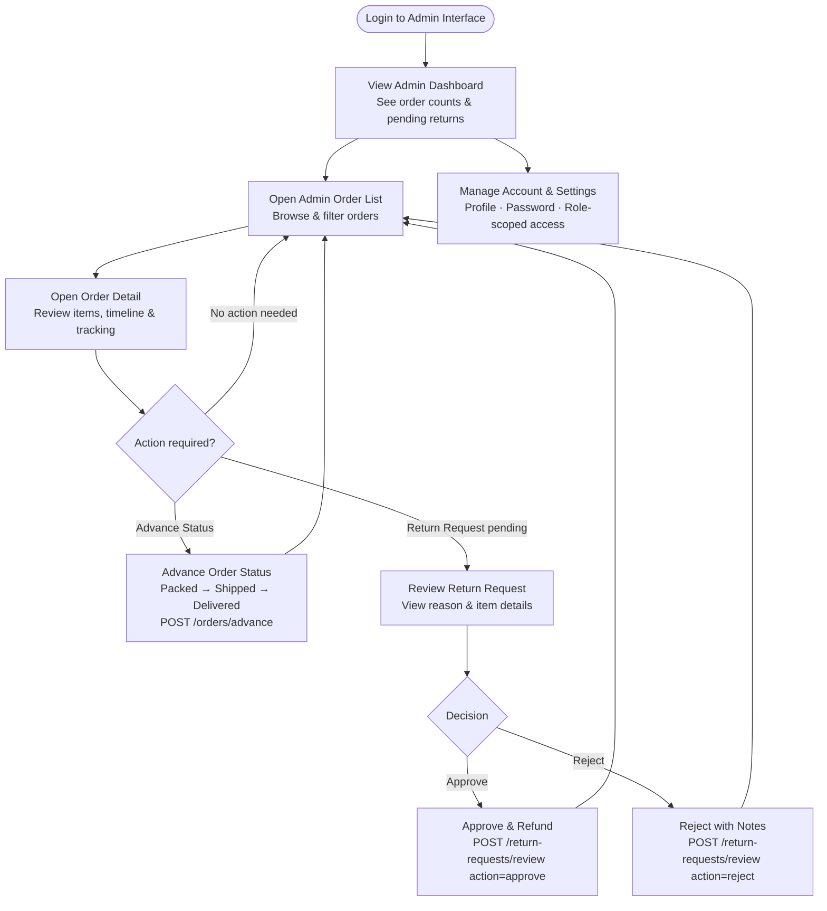

```mermaid
flowchart TD
    A([Login to Admin Interface]) --> B[View Admin Dashboard\nSee order counts & pending returns]
    B --> C[Open Admin Order List\nBrowse & filter orders]
    C --> D[Open Order Detail\nReview items, timeline & tracking]
    D --> E{Action required?}
    E -->|Advance Status| F[Advance Order Status\nPacked → Shipped → Delivered\nPOST /orders/advance]
    E -->|Return Request pending| G[Review Return Request\nView reason & item details]
    E -->|No action needed| C
    F --> C
    G --> H{Decision}
    H -->|Approve| I[Approve & Refund\nPOST /return-requests/review action=approve]
    H -->|Reject| J[Reject with Notes\nPOST /return-requests/review action=reject]
    I --> C
    J --> C
    B --> K[Manage Account & Settings\nProfile · Password · Role-scoped access]
```
