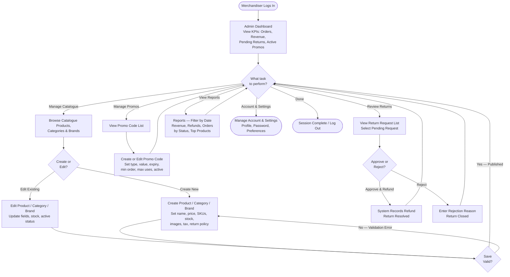

```mermaid
flowchart TD
    A([Merchandiser Logs In]) --> B[Admin Dashboard\nView KPIs: Orders, Revenue,\nPending Returns, Active Promos]
    B --> C{What task\nto perform?}

    C -->|Manage Catalogue| D[Browse Catalogue Products,\nCategories & Brands]
    D --> E{Create or\nEdit?}
    E -->|Create New| F[Create Product / Category / Brand\nSet name, price, SKUs, stock,\nimages, tax, return policy]
    E -->|Edit Existing| G[Edit Product / Category / Brand\nUpdate fields, stock, active status]
    F --> H{Save\nValid?}
    G --> H
    H -->|Yes — Published| C
    H -->|No — Validation Error| F

    C -->|Manage Promos| I[View Promo Code List]
    I --> J[Create or Edit Promo Code\nSet type, value, expiry,\nmin order, max uses, active]
    J --> C

    C -->|Review Returns| K[View Return Request List\nSelect Pending Request]
    K --> L{Approve or\nReject?}
    L -->|Approve & Refund| M[System Records Refund\nReturn Resolved]
    L -->|Reject| N[Enter Rejection Reason\nReturn Closed]
    M --> C
    N --> C

    C -->|View Reports| O[Reports — Filter by Date\nRevenue, Refunds, Orders\nby Status, Top Products]
    O --> C

    C -->|Account & Settings| P([Manage Account & Settings\nProfile, Password, Preferences])

    C -->|Done| Q([Session Complete / Log Out])
```
