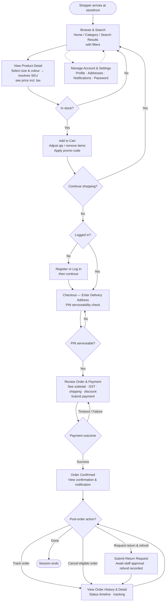

```mermaid
flowchart TD
    A([Shopper arrives at storefront]) --> B[Browse & Search\nHome / Category / Search Results\nwith filters]
    B --> C[View Product Detail\nSelect size & colour → resolves SKU\nsee price incl. tax]
    C --> D{In stock?}
    D -- No --> B
    D -- Yes --> E[Add to Cart\nAdjust qty / remove items\nApply promo code]
    E --> F{Continue shopping?}
    F -- Yes --> B
    F -- No --> G{Logged in?}
    G -- No --> REG[Register or Log In\nthen continue]
    REG --> H
    G -- Yes --> H[Checkout — Enter Delivery Address\nPIN serviceability check]
    H --> PIN{PIN serviceable?}
    PIN -- No --> H
    PIN -- Yes --> I[Review Order & Payment\nSee subtotal · GST · shipping · discount\nSubmit payment]
    I --> PAY{Payment outcome}
    PAY -- Timeout / Failure --> I
    PAY -- Success --> J[Order Confirmed\nView confirmation & notification]
    J --> K{Post-order action?}
    K -- Track order --> L[View Order History & Detail\nStatus timeline · tracking]
    K -- Cancel eligible order --> L
    K -- Request return & refund --> M[Submit Return Request\nAwait staff approval · refund recorded]
    M --> L
    L --> K
    K -- Done --> Z([Session ends])

    B -.-> ACC[Manage Account & Settings\nProfile · Addresses · Notifications · Password]
    ACC -.-> B
```
