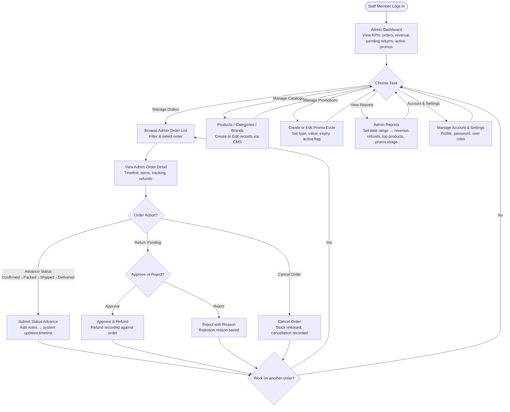

```mermaid
flowchart TD
    A([Staff Member Logs In]) --> B[Admin Dashboard\nView KPIs: orders, revenue,\npending returns, active promos]
    B --> C{Choose Task}

    C -->|Manage Orders| D[Browse Admin Order List\nFilter & select order]
    D --> E[View Admin Order Detail\nTimeline, items, tracking, refunds]
    E --> F{Order Action?}
    F -->|Advance Status\nConfirmed→Packed→Shipped→Delivered| G[Submit Status Advance\nAdd notes → system updates timeline]
    F -->|Return Pending| H{Approve or Reject?}
    H -->|Approve| I[Approve & Refund\nRefund recorded against order]
    H -->|Reject| J[Reject with Reason\nRejection reason saved]
    F -->|Cancel Order| K[Cancel Order\nStock released, cancellation recorded]
    G & I & J & K --> L{Work on another order?}
    L -->|Yes| D
    L -->|No| C

    C -->|Manage Catalogue| M[Products / Categories / Brands\nCreate or Edit records via CMS]
    M --> C

    C -->|Manage Promotions| N[Create or Edit Promo Code\nSet type, value, expiry, active flag]
    N --> C

    C -->|View Reports| O[Admin Reports\nSet date range → revenue,\nrefunds, top products, promo usage]
    O --> C

    C -->|Account & Settings| P[Manage Account & Settings\nProfile, password, user roles]
    P --> C
```
